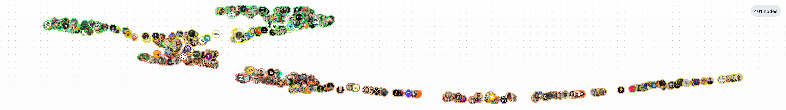

= NostrGNN

A sandbox for graph neural networks on Nostr.

== Description

This project aims to explore the use of graph neural networks for Web-of-Trust on Nostr.

Graph neural networks like GraphSAGE can generate node embeddings by performing neighborhood aggregation across H-hops via message passing.

By integrating rich node features, the system can capture latent social dynamics and trust signals present in a social network.

The goal is to understand how graph neural networks can be used for user similarity and recommendation, edge prediction, community detection, and approaches like two-tower embeddings on Nostr, among other tasks.

== NostrSAGE

Unlike embedding approaches that are based on matrix factorization, GraphSAGE leverages both node features and graph topology to generate embeddings.

By sampling and aggregating features from a node’s local neighborhood, the model is inherently inductive, meaning it can generate embeddings for nodes that were not seen during training.

NostrSAGE is a GraphSAGE model with 20,672 parameters, trained on Nostr data to predict follow edges with mute edges as negative supervision. It was trained on 3,251,430 nodes, 34,978,448 follow edges, and 215,627 mute edges, in a single L4 GPU in approximately 15 minutes.

Individual node embeddings can be distributed across relays as standard Nostr events signed by a "model provider". Clients can perform local inference to generate new embeddings for unseen nodes or update existing ones based on new graph data, removing the reliance on service provider recomputation. This enables client-side operations like cosine similarity and nearest neighbor search, while specialized search relays can utilize vector databases with HNSW or ANN indexes.

The model uses a two-layer architecture to aggregate information from a 2-hop neighborhood through message passing. This is a common practice in graph neural networks, as stacking too many layers can lead to https://www.youtube.com/watch?v=ew1cnUjRgl4[over-smoothing], where node representations become indistinguishable.

To capture an expressive graph structure, NostrSAGE uses NIP-85 trusted assertions generated by https://github.com/nosotros-social/noiad[noiad] as node features. This is not trivial for client-side embedding generation, so the goal is to experiment with different and more lightweight feature sets.

== Embeddings

Currently embeddings are published on `wss://noiad.nosotros.app` as kind `31313` and the model metadata as `31312`.

Kind `31313` user embeddings:

[source,json]
----
{
  "kind": 31313,
  "id": "1803eacc4d49984b6ce621f28f996090027a4b912164575995cbdcd028f50a52",
  "pubkey": "e8c77dbd1d0ed2f5f44ae03af454bfdb0963655fd5562b5361263c3200de5ca8",
  "created_at": 1775695442,
  "tags": [
    ["d", "nostr-sage-v1_c6603b0f1ccfec625d9c08b753e4f774eaf7d1cf2769223125b5fd4da728019e"],
    ["model_id", "nostr-sage-v1"],
    ["p", "c6603b0f1ccfec625d9c08b753e4f774eaf7d1cf2769223125b5fd4da728019e"],
    ["vector", "[0.8044632,0.69455117,-0.12837201,-1.3915666,0.34263742,-1.6429046,0.14337601,0.5145526,-0.3089899,0.71465385,-1.6264344,-0.6873342,0.503646,-1.4392152,-1.1553068,1.0074772,0.3928243,1.0841908,0.31155977,-0.25490195,0.49559528,-0.9163955,0.0038369596,0.14810601,0.68076646,-0.3206087,1.0626315,0.75525475,0.033322163,0.29537272,0.044314876,0.88337857,0.12603547,-0.979646,-0.7396546,-0.48713055,-0.6138517,-0.14335197,-1.5693622,-0.4061802,0.3617304,-0.9257033,0.48382443,-1.0576831,0.04043928,1.0022932,-0.23653343,0.64118636,0.8059082,-0.514401,-0.31035978,-0.48998517,0.23968722,0.31213287,-1.0337044,0.9249717,0.46198684,0.36630037,0.9505809,0.31129095,0.4278264,-0.47001344,-0.12812541,-0.7580911]"]
  ],
  "content": "",
  "sig": "60311a7acc9100439025b968962faef52d550bb1cb243fd6798af63af2baa82f723e026972eafe3308b3d1f5d4dfcc52f7b6b9af7fb89b1571763af0df885c1f"
}
----

Kind `31312` model metadata:

Model metadata provides detailed information about the model architecture and the information required for inference and embedding generation for unseen nodes.

[source,json]
----
{
  "kind": 31312,
    "id": "61d512e4422c2c5b622a3dd4d67f0d59c3485f5ba8ec585d660a16b294343881",
    "pubkey": "e8c77dbd1d0ed2f5f44ae03af454bfdb0963655fd5562b5361263c3200de5ca8",
    "created_at": 1775695442,
    "tags": [
      ["d", "nostr-sage-v1"],
      ["model_id", "nostr-sage-v1"],
      ["architecture", "graphsage"],
      ["meta", "embedding_dim", "64"],
      ["meta", "feature_dim", "16"],
      ["meta", "feature_transform", "zero_fill_then_zscore_v1"],
      ["meta", "scorer", "dot_product"],
      ["meta", "activation", "relu"],
      ["meta", "aggregator", "mean"],
      ["meta", "bias", "true"],
      ["meta", "edge_direction", "directed"],
      ["edge_types", "follow"],
      ["meta", "hidden_channels", "128"],
      ["meta", "num_layers", "2"],
      ["meta", "output_normalization", "none"],
      ["meta", "root_weight", "true"],
      ["meta", "self_loops", "false"],
      ["meta", "num_nodes", "3251430"],
      ["meta", "param_count", "20672"],
      ["meta", "weights_format", "flatbin-v1"],
      ["meta", "weights_dtype", "float32"],
      ["meta", "endianness", "little"],
      ["meta", "tensor_count", "6"],
      ["features", "rank", "follower_cnt", "post_cnt", "reply_cnt", "reactions_cnt", "reports_cnt_sent", "reports_cnt_recd", "zap_amt_sent", "zap_amt_recd", "zap_cnt_sent", "zap_cnt_recd", "zap_avg_amt_day_sent", "zap_avg_amt_day_recd", "first_created_at", "active_hours_start", "active_hours_end"],
      ["feature_mean", "[0.4806639,3.9382253,6.931771,2.7094426,8.406919,0.053366672,0.043006,4828.551,773722.6,0.045393564,0.060694832,183.11034,3338.5645,432456160.0,2.6987848,3.4458804]"],
      ["feature_std", "[4.3521156,147.2472,437.83997,195.70558,778.17395,17.529661,2.1020544,8682903.0,1177776400.0,4.3400354,12.840858,321630.53,4467932.0,737570800.0,5.8258643,6.7809467]"],
      ["artifact", "weights", "a4e11d5d75bd08936798264ac59927e29aee8d678f1c19068907922d138f3b6b"],
      ["imeta", "url https://blossom.nosotros.app/6c10ce0a73be77be8bc4535d7e69844c2c236dd7d66dbf2542ac58fb101586bf.zip", "x 6c10ce0a73be77be8bc4535d7e69844c2c236dd7d66dbf2542ac58fb101586bf", "m application/octet-stream", "name model", "format pt", "alt model", "role training"],
      ["imeta", "url https://blossom.nosotros.app/cf04f68fcc10986fa9925b6dc9c023f7a822258bef8a9cafac99114017d77c26.zip", "x cf04f68fcc10986fa9925b6dc9c023f7a822258bef8a9cafac99114017d77c26", "m application/octet-stream", "name embeddings", "format pt", "alt embeddings", "role dataset"],
      ["imeta", "url https://blossom.nosotros.app/9ab8bd02d59919eba58c2ee3c709849e86978c3bdda4a58d115e3cc2289a0ed4", "x 9ab8bd02d59919eba58c2ee3c709849e86978c3bdda4a58d115e3cc2289a0ed4", "m application/octet-stream", "name index_node_id", "format npy", "alt index node ids", "role dataset"],
      ["imeta", "url https://blossom.nosotros.app/cdd0dbada9cc7aa056e2da3f84220eec06c0ee71bb91ef9d2b35aec51ab2cb2a", "x cdd0dbada9cc7aa056e2da3f84220eec06c0ee71bb91ef9d2b35aec51ab2cb2a", "m application/octet-stream", "name node_id_pubkey", "format parquet", "alt node id pubkey mapping", "role dataset"],
      ["imeta", "url https://blossom.nosotros.app/a4e11d5d75bd08936798264ac59927e29aee8d678f1c19068907922d138f3b6b", "x a4e11d5d75bd08936798264ac59927e29aee8d678f1c19068907922d138f3b6b", "m application/octet-stream", "name weights", "format bin", "alt weights", "role inference"],
      ["tensor", "conv1.lin_l.weight", "128x16", "float32", "0", "8192", "2048"],
      ["tensor", "conv1.lin_l.bias", "128", "float32", "8192", "512", "128"],
      ["tensor", "conv1.lin_r.weight", "128x16", "float32", "8704", "8192", "2048"],
      ["tensor", "conv2.lin_l.weight", "64x128", "float32", "16896", "32768", "8192"],
      ["tensor", "conv2.lin_l.bias", "64", "float32", "49664", "256", "64"],
      ["tensor", "conv2.lin_r.weight", "64x128", "float32", "49920", "32768", "8192"]
    ],
    "content": "",
    "sig": "389932cc64d857168d471a6c7b47fb565a424c0cb8b01b7800fb2389da1680563b4d9ecae84a24d84d4959bc79573d6d28046fecdcecfd21e5fe6da7b12860ed"
}
----

== Training

The model can be trained on https://modal.com[Modal] with:

[source,bash]
----
modal run src/modal_run.py --action train --overrides "--config-path .. --config-name config.modal"
----

== License

link:LICENSE[MIT]
